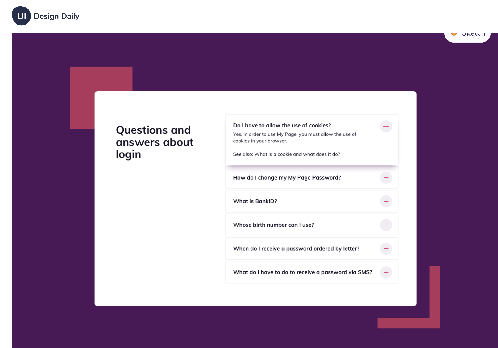

-   [https://react-projects-4-accordion.netlify.app/](https://react-projects-4-accordion.netlify.app/)

-   This project uses Ai Icons which generates an error in the console
-   "React does not recognize the `pId` prop on a DOM element."
-   would use Font Awesome, otherwise it works fine
-   might add a smooth animation for the dropdown / roll up

#### Idea

[uidesigndaily](https://uidesigndaily.com/posts/sketch-accordion-website-day-1175)

;

#### React Icons

[react icons](https://react-icons.github.io/react-icons/)

```
npm install react-icons --save
```

```javascript
import { FaHome } from "react-icons/fa";
const Component = () => {
    return <FaHome className="icon"></FaHome>;
};
```
